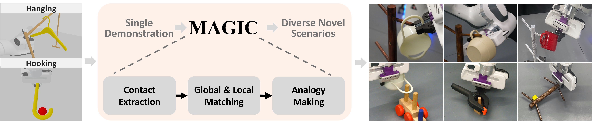
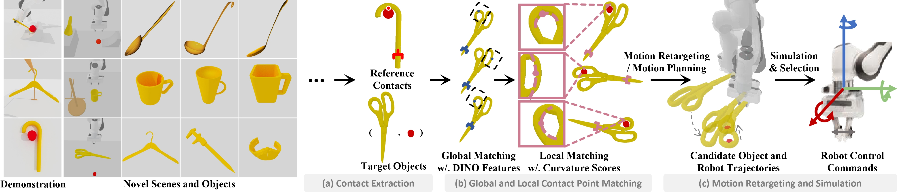

<p align="center">
  <h1 align="center">One-Shot Manipulation Strategy Learning by Making Contact Analogies</h1>
</p>

[](https://www.pytorch.org)
[](https://github.com/nature21/magic/blob/master/LICENSE)
<!--[](https://arxiv.org/abs/)-->
<!--[](https://x.com)-->

This repo is the official code release for MAGIC:
<p align="center">&nbsp;<table><tr><td>
    <p align="center">
    <strong>
        <a href="https://magic-2024.github.io">
            One-Shot Manipulation Strategy Learning by Making Contact Analogies
        </a><br/>
    </strong>
    Yuyao Liu*<sup>1</sup>, Jiayuan Mao*<sup>2</sup>, Joshua Tenenbaum<sup>2</sup>, Tomás Lozano-Pérez<sup>2</sup>, Leslie Pack Kaelbling<sup>2</sup><br>
    <sup>1</sup><em>Tsinghua Universtiy, IIIS&nbsp;&nbsp;</em>
    <sup>2</sup><em>Massachusetts Institute of Technology</em><br>
    *Equal contribution
    </p>
</td></tr></table>&nbsp;</p>


# 🧾 Introduction
We present a novel approach, **MAGIC** (manipulation analogies for generalizable intelligent contacts), for one-shot learning of manipulation strategies with fast and extensive generalization to novel objects. By leveraging a reference action trajectory, **MAGIC** effectively identifies similar contact points and sequences of actions on novel objects to replicate a demonstrated strategy, such as using different hooks to retrieve distant objects of different shapes and sizes.

<p align="center">
  
</p>

Our method is based on a two-stage contact-point matching process that combines global shape matching using pretrained neural features with local curvature analysis to ensure precise and physically plausible contact points. We experiment with three tasks including scooping, hanging, and hooking objects. *Our pipeline combines data-driven (pretrained DINOv2 visual features) and analytic (curvature) approaches from one single demonstration, without any additional training or task specific datasets.*

<p align="center">
  
</p>

**MAGIC** demonstrates superior performance over existing methods, achieving significant improvements in runtime speed and generalization to different object categories.

# 💻 Installation
## Environment
Start by creating a new conda environment. 
```bash
conda create -n magic python=3.10
conda activate magic
pip install torch==2.1.0 torchvision==0.16.0 --index-url https://download.pytorch.org/whl/cu121
````

Then install [Jacinle](https://github.com/vacancy/Jacinle).
```bash
git clone https://github.com/vacancy/Jacinle --recursive
export PATH=<path_to_jacinle>/bin:$PATH
cd Jacinle 
pip install -e .
cd ..
```

The commands in the following block is optional, only required if you want to try out image features from [SD-DINO](https://github.com/Junyi42/sd-dino) and [DIFT](https://github.com/Tsingularity/dift).

```bash
cd image_features/third_party/Mask2Former
pip intall -e .
cd ../ODISE
pip install -e .
cd ../../..
```

Finally, install the other dependencies.

```bash
pip install -r requirements.txt
```

## Assets
Download the meshes and urdf files from this [link](), and extract it as the `./assets` folder. The assets folder should look like this:
```
assets
├── custom_objects
├── ig
├── panda
├── shapenet_mug
└── shapenet_spoon
```

# 🛠️ Usage 
To reproduce our simulation results with one click, run the following commands. You can see the rendered videos of the trajectory in `./videos`, the visualization of global contact points found by DINOv2 and the local alignment established by curvature `./results`.

```bash
# scooping
# spoon_id can be 1, 2, ..., 6
jac-run scripts/scooping.py --spoon_id 1 --target 0.035 --save_video 1

# hanging mug_id can be 0, 1, ..., 200
jac-run scripts/hanging.py --mug_id 1 --save_video 1

# hooking
jac-run scripts/hooking.py --tool scissors --target 0.015 --save_video 1
jac-run scripts/hooking.py --tool hanger --target 0.02 --save_video 1
jac-run scripts/hooking.py --tool caliper --target 0.025 --save_video 1
jac-run scripts/hooking.py --tool watch --target 0.035 --save_video 1
```
Moreover, you can visualize the similarity heatmap generated by DINOv2, SD-DINO, and DIFT with in the jupyter notebook `visualize_heatmap.ipynb`.


# 🙏 Acknowledgement
**MAGIC** is based on many open-source projects, including [SAPIEN2](https://github.com/haosulab/SAPIEN), [ManiSkill2](https://github.com/haosulab/ManiSkill/tree/v0.5.3), [MPLib](https://github.com/haosulab/MPlib), [SD-DINO](https://github.com/Junyi42/sd-dino), and [DIFT](https://github.com/Tsingularity/dift). We thank all these authors for their nicely open sourced code and their great contributions to the community.

# 🏷️ License
**MAGIC** is licensed under the MIT license. See the [LICENSE](LICENSE) file for details.

[//]: # (# 📝 Citation)

[//]: # (If you find our work useful, please consider citing:)

[//]: # (```)

[//]: # (@article{liu2024magic,)

[//]: # (  title = {One-Shot Manipulation Strategy Learning by Making Contact Analogies},)

[//]: # (  author = {Liu, Yuyao and Mao, Jiayuan and Tenenbaum, Joshua and Lozano-Pérez, Tomás and Kaelbling, Leslie},)

[//]: # (  journal = {arXiv preprint arXiv:},)

[//]: # (  year = {2024})

[//]: # (})

[//]: # (```)